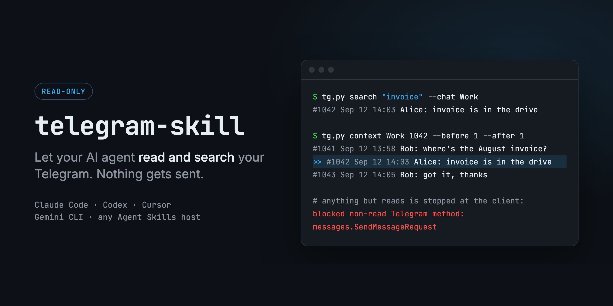

Telegram access for AI agents. Your agent can list chats, read history, search messages, and pull up the conversation around a result.

For now it only reads: sending is planned.

Works with Claude Code, Codex, Cursor, Gemini CLI, and other agents that support [Agent Skills](https://agentskills.io).

## Safety

Until sending lands, two things keep the agent to reading:

- **Allowlist in the client.** Every request to Telegram passes a list of about 20 read methods ([guard.py](skills/telegram/scripts/tgskill/guard.py)). Anything else fails before it leaves your machine. The CLI has no write commands to begin with.
- **Hook for the agent.** Plugin installs add a `PreToolUse` hook that blocks the agent from reading the session files or editing the CLI ([protect_session.py](hooks/protect_session.py)).

The hook is a guard rail, not a sandbox. The session file lives under your OS user and grants full account access. You can revoke it any time in Telegram: Settings → Devices.

## Install

Requires [uv](https://docs.astral.sh/uv/) (`brew install uv`).

**Claude Code**

```
/plugin marketplace add cloud-yyy/telegram-skill
/plugin install telegram@telegram-skill
```

**Codex**

```
codex plugin marketplace add cloud-yyy/telegram-skill
```

Then enable `telegram` in `/plugins`.

**Other agents** (skill only, without the hook):

```
npx skills add cloud-yyy/telegram-skill -g
```

## Sign in

Once, in your own terminal:

1. Create an app at [my.telegram.org](https://my.telegram.org) → API development tools. You'll need `api_id` and `api_hash`.
2. Run `login` from any copy of the CLI, e.g.:

   ```
   git clone https://github.com/cloud-yyy/telegram-skill
   telegram-skill/skills/telegram/scripts/tg.py login
   ```

   Pick QR code (scan in Telegram → Settings → Devices → Link Desktop Device) or phone code.

The session is saved to `~/.config/telegram-skill/` (mode 600) and shared by every install. Set `TG_SKILL_HOME` to use another directory.

## Use

Ask in plain language:

- "What did Misha send me today?"
- "Find where we discussed the invoice in the Work chat and show what was said around it."
- "Summarize the last 50 messages in @some_channel."

Commands the agent uses are documented in [SKILL.md](skills/telegram/SKILL.md).

## License

MIT
